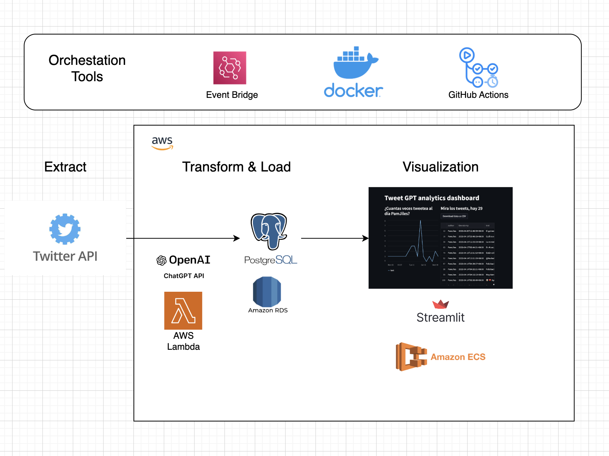
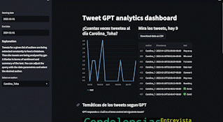

# :bird: Twitter GPT analytics
In this repository I've developed a Python app in Streamlit and deployed it with Docker on AWS. It takes
information from the Twitter API and uses gpt-3.5 to make analysis regarding keywords for every tweet and a summary. Currently it's extracting
tweets from chilean politicians via Lambda Function and storing them in a RDS.

## Architecture 


## Visualization 


## Local setup
If you would like to run such project locally, then install `conda` and do the following after:

1. Navigate to or make a directory for your proyect where you will create your virtual environment
```sh
conda create --name tweet_analytics_py38 python=3.8 spyder
conda activate tweet_analytics_py38
conda install -c conda-forge poetry # dependency management
conda install -c conda-forge dotenv # to manage environment variables
```

2. Install the project dependencies with poetry
```sh
poetry install
```

3. Setup a .env file with environment variables. This only makes sense if you use the same architecture
```
DB_HOST = 'XXXX'
DB_PASSWORD = 'XXXX'
IAM_AWS_ACCESS_KEY = 'XXXX'
IAM_AWS_SECRET_ACCESS_KEY = 'XXXX'
OPENAI_API_KEY = 'XXXX'
TWITTER_API_KEY = 'XXXX'
TWITTER_API_SECRET = 'XXXX'
TWITTER_BUCKET = 'XXXX' 
```

Finally to run the dashboard locally
```
poetry run streamlit run tweet_gpt_analytics/app.py
```
